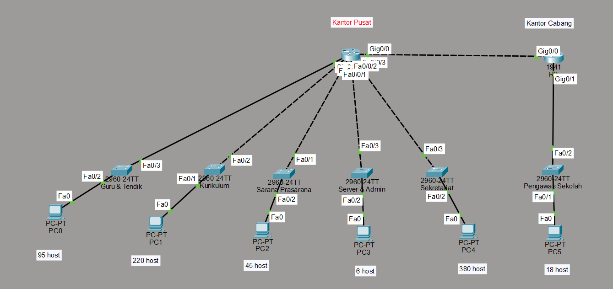
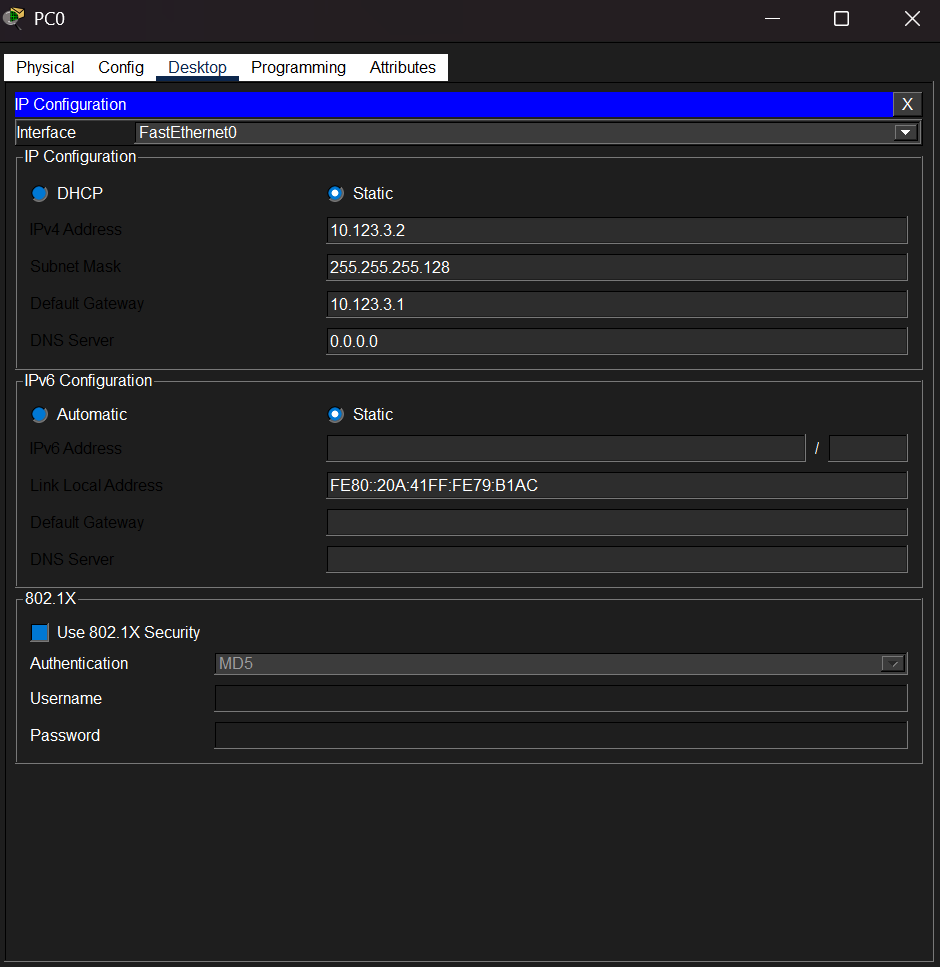
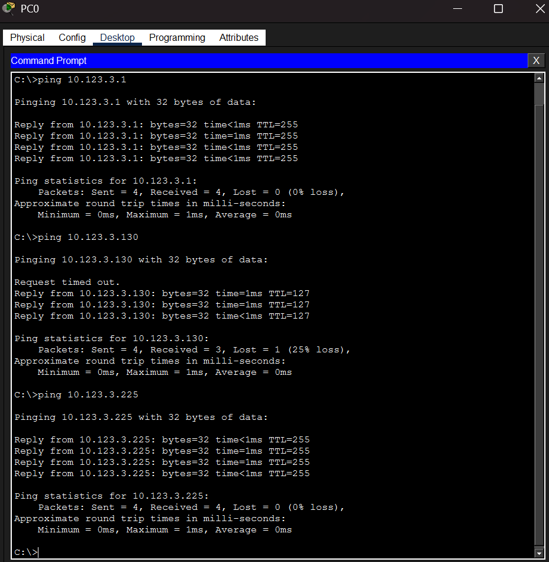
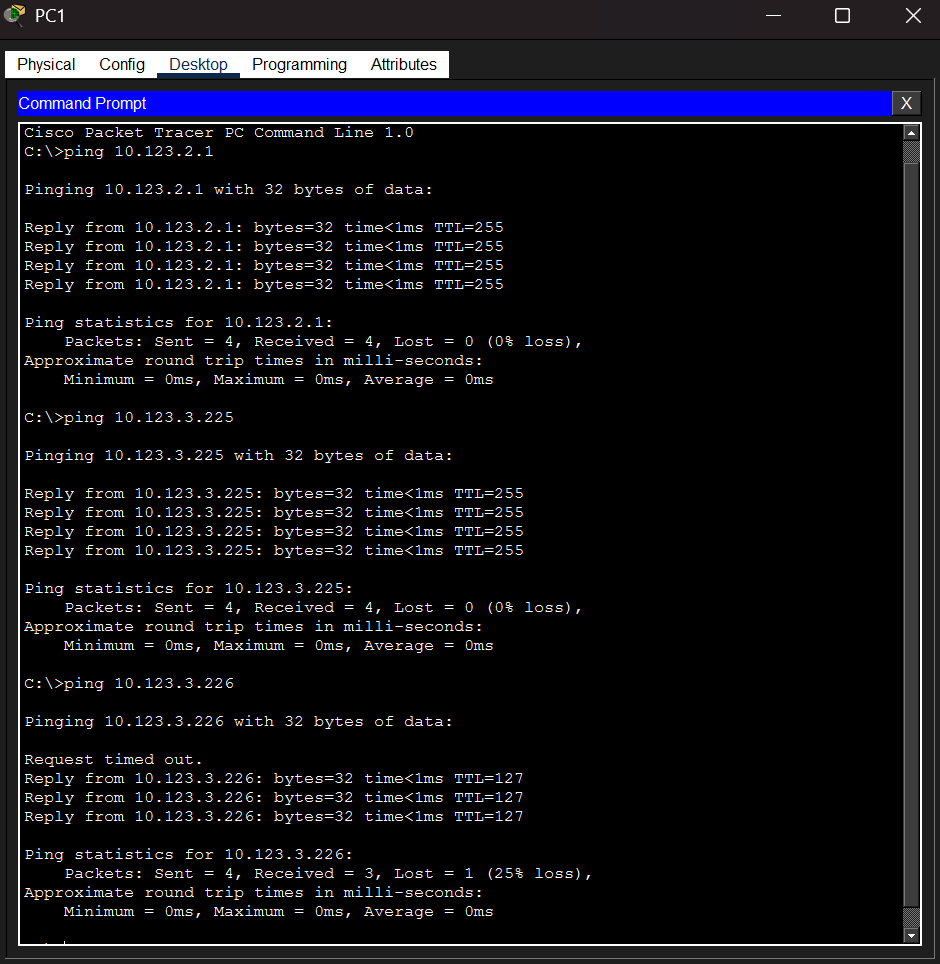
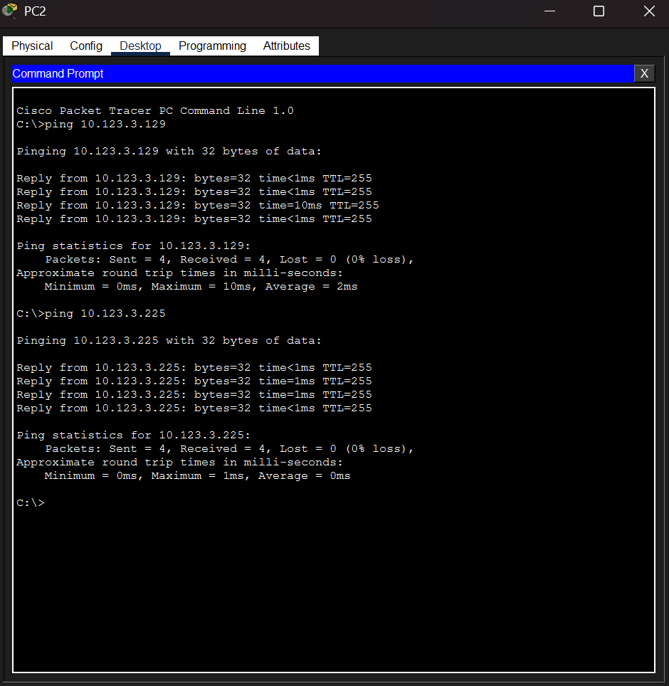
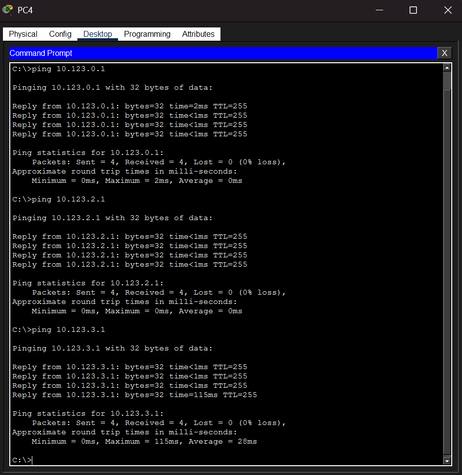
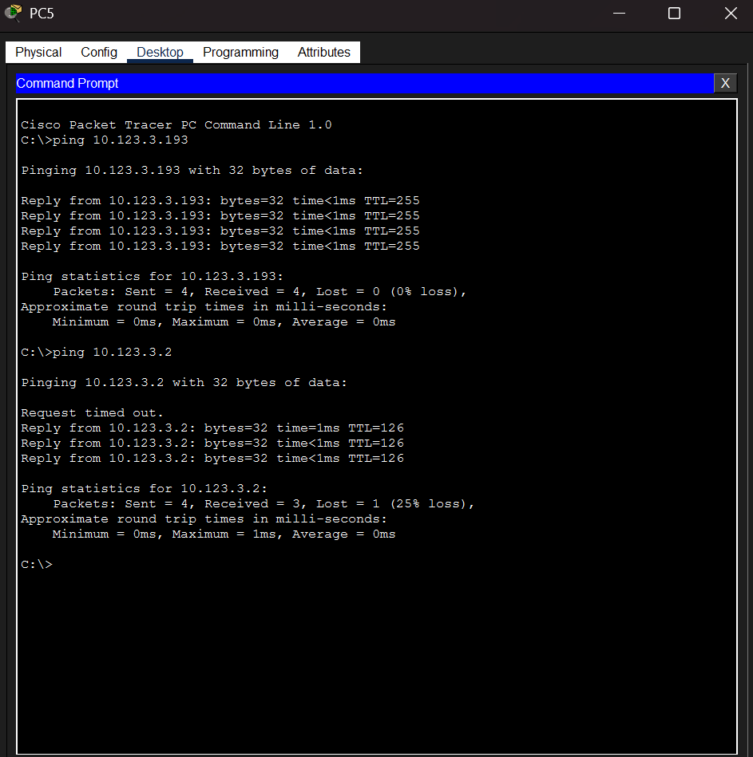

# Tugas-1-Jarkom_Mutiara-Diva_083
Dokumentasi Tugas 1 Jarkom Subnetting

## Topologi

Menggunakan:
- 2 Router 1941 dengan tambahan module HWIC-4ESW
- 6 Switch 2960-24TT
- 6 PC PC-PT

## Konfigurasi

### Konfigurasi R1
```
enable
configure terminal
hostname R1

! Link ke R2 (antar-router)
interface GigabitEthernet0/0
 description "Link ke R2"
 ip address 10.123.3.233 255.255.255.252
 no shutdown
exit

! Guru & Tendik (langsung L3, tanpa VLAN)
interface GigabitEthernet0/1
 description "Guru & Tendik"
 ip address 10.123.3.1 255.255.255.128
 no shutdown
exit

! VLAN untuk jaringan dari HWIC-4ESW
vlan 10
 name Kurikulum
vlan 20
 name SaranaPrasarana
vlan 30
 name ServerAdmin
vlan 40
 name Sekretariat
exit

! Interface VLAN (SVI)
interface Vlan10
 description "Kurikulum"
 ip address 10.123.2.1 255.255.255.0
 no shutdown
exit

interface Vlan20
 description "Sarana & Prasarana"
 ip address 10.123.3.129 255.255.255.192
 no shutdown
exit

interface Vlan30
 description "Server & Admin"
 ip address 10.123.3.225 255.255.255.248
 no shutdown
exit

interface Vlan40
 description "Sekretariat"
 ip address 10.123.0.1 255.255.254.0
 no shutdown
exit

! Hubungkan port HWIC ke VLAN masing-masing
interface FastEthernet0/0/0
 description "Kurikulum"
 switchport access vlan 10
 no shutdown
exit

interface FastEthernet0/0/1
 description "Sarana & Prasarana"
 switchport access vlan 20
 no shutdown
exit

interface FastEthernet0/0/2
 description "Server & Admin"
 switchport access vlan 30
 no shutdown
exit

interface FastEthernet0/0/3
 description "Sekretariat"
 switchport access vlan 40
 no shutdown
exit

! Static route ke jaringan cabang (Pengawas Sekolah)
ip route 10.123.3.192 255.255.255.224 10.123.3.234

end
write memory

```

### Konfigurasi R2
```
enable
configure terminal
hostname R2

! Link ke R1
interface GigabitEthernet0/0
 description "Link ke R1"
 ip address 10.123.3.234 255.255.255.252
 no shutdown
exit

! Pengawas Sekolah (Cabang)
interface GigabitEthernet0/1
 description "Pengawas Sekolah"
 ip address 10.123.3.193 255.255.255.224
 no shutdown
exit

! Static route ke semua network di R1
ip route 10.123.0.0 255.255.252.0 10.123.3.233

end
write memory
```

### Konfigurasi Switch pada setiap Jaringan

```
enable
configure terminal
hostname SW-Kurikulum

interface FastEthernet0/1
 description "Ke Router (Fa0/0/0)"
 switchport mode access
 switchport access vlan 10
 no shutdown
exit

interface FastEthernet0/2
 description "Ke PC Kurikulum"
 switchport mode access
 switchport access vlan 10
 no shutdown
exit

end
write memory
```

Ulangi hal yang sama untuk:
- VLAN 20 → Sarana Prasarana
- VLAN 30 → Server & Admin
- VLAN 40 → Sekretariat
Bedanya cuma di `switchport access vlan X` dan hostname switch-nya.

### Konfigurasi PC
1. Klik PC yang ingin dikonfigurasi
2. Masuk ke tab `Physical`
3. Klik IP Configuration di pojok kiri atas
4. Konfigurasi IP PC sesuai tabel berikut:

| Nama Subnet                | Nama PC              | IP PC          | Subnet Mask      | Default Gateway |
|----------------------------|----------------------|----------------|------------------|-----------------|
| Sekretariat                | PC4                  | 10.123.0.2     | 255.255.254.0    | 10.123.0.1      |
| Kurikulum                  | PC1                  | 10.123.2.2     | 255.255.255.0    | 10.123.2.1      |
| Guru & Tendik              | PC0                  | 10.123.3.2     | 255.255.255.128  | 10.123.3.1      |
| Sarana Prasarana           | PC2                  | 10.123.3.130   | 255.255.255.192  | 10.123.3.129    |
| Pengawas Sekolah (Cabang)  | PC5                  | 10.123.3.194   | 255.255.255.224  | 10.123.3.193    |
| Server & Admin             | PC3                  | 10.123.3.226   | 255.255.255.248  | 10.123.3.225    |





## Testing

Pastikan semua interface statusnya `up up`:
```
show ip interface brief
```

### 1. Tes Host ke Gateway (Default Gateway Test)

Setiap subnet harus bisa ping ke gateway-nya:

- PC4 (Sekretariat) → 10.123.0.1
- PC1 (Kurikulum) → 10.123.2.1
- PC0 (Guru & Tendik) → 10.123.3.1
- PC2 (Sarana Prasarana) → 10.123.3.129
- PC5 (Pengawas Sekolah) → 10.123.3.193
- PC3 (Server & Admin) → 10.123.3.225

Tujuan: memastikan gateway router di setiap subnet aktif dan IP interface router benar.

### 2. Tes Antar-Subnet (Inter-VLAN / Inter-Subnet Communication)

Setelah routing aktif (static atau dynamic), pastikan antar-LAN bisa berkomunikasi:

- PC4 (Sekretariat) → PC1 (Kurikulum) (10.123.2.2)
- PC4 (Sekretariat) → PC0 (Guru & Tendik) (10.123.3.2)
- PC1 (Kurikulum) → PC3 (Server & Admin) (10.123.3.226)
- PC0 (Guru & Tendik) → PC2 (Sarana Prasarana) (10.123.3.130)

Tujuan: memastikan tabel routing di router sudah lengkap.

### 3. Tes ke Server (End-to-End Test)

Simulasi layanan pusat:

- PC0 (Guru & Tendik) → 10.123.3.225 (Server & Admin)
- PC2 (Sarana Prasarana) → 10.123.3.225
- PC1 (Kurikulum) → 10.123.3.225

Tujuan: memastikan semua subnet bisa mengakses server pusat (rute ke arah server benar).

#### DOkumentasi





